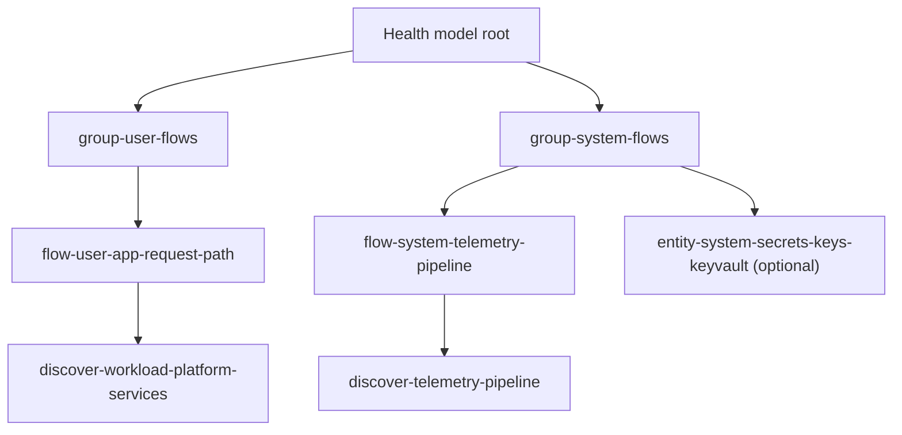

# Platform health model

Deploys an Azure Monitor Health Model for ALZ as readable user and system flows, not broad resource buckets.

## Topology shape

The template creates:

- root model entity (`parHealthModelName`)
- `group-user-flows` and `group-system-flows`
- flow entities under each group
- discovery entities linked from flows
- optional explicit AMBA reference entity for Key Vault thresholds



## User flows and operational questions

| User flow | Operational question |
|---|---|
| `flow-user-app-request-path` | Can users reach ingress and front-end endpoints? |
| `flow-user-app-data-access` | Can workloads read and write required data and secrets paths? |
| `flow-user-workload-compute` | Are workload runtimes healthy enough to serve traffic? |
| `flow-user-workload-recovery` | Can workloads recover with backup and restore dependencies available? |

## System flows and operational questions

| System flow | Operational question |
|---|---|
| `flow-system-hybrid-connectivity` | Are ER/VPN/transit links carrying traffic as expected? |
| `flow-system-internet-edge` | Is edge ingress/egress healthy and protected? |
| `flow-system-name-resolution` | Are platform DNS paths resolving correctly? |
| `flow-system-network-control-plane` | Are platform network control resources healthy enough to enforce routes and segmentation? |
| `flow-system-secure-operations-access` | Is privileged operational access available and controlled? |
| `flow-system-secrets-and-keys` | Are key and identity primitives available for platform and workloads? |
| `flow-system-telemetry-pipeline` | Are monitoring ingestion, query, and alerting resources healthy? |
| `flow-system-platform-automation` | Are automation and recovery services healthy? |
| `flow-system-governance-and-compliance` | Is the governance control plane present and evaluable? |
| `flow-system-workload-platform-services` | Are shared workload platform services available? |
| `flow-system-azure-platform-health` | Are Azure platform incidents represented externally and tracked as caveats? |

## Resource-to-flow homes

The module keeps one discovery rule per type set, then links multiple flows to each rule when overlap is intentional.

| Resource type | System-flow home(s) |
|---|---|
| `Microsoft.Network/expressRouteCircuits`, `.../virtualNetworkGateways`, `.../connections`, `.../virtualWans`, `.../virtualHubs`, `.../vpnGateways`, `.../vpnSites`, `.../expressRouteGateways` | `flow-system-hybrid-connectivity` |
| `Microsoft.Network/publicIPAddresses`, `.../loadBalancers`, `.../applicationGateways`, `.../natGateways`, `.../azureFirewalls`, `.../firewallPolicies`, `.../ddosProtectionPlans` | `flow-system-internet-edge` |
| `Microsoft.Network/privateDnsZones`, `.../dnsResolvers` | `flow-system-name-resolution` |
| `Microsoft.Network/virtualNetworks`, `.../routeTables`, `.../networkSecurityGroups` | `flow-system-network-control-plane` |
| `Microsoft.Network/bastionHosts` | `flow-system-secure-operations-access` |
| `Microsoft.KeyVault/vaults`, `Microsoft.ManagedIdentity/userAssignedIdentities` | `flow-system-secrets-and-keys` |
| `Microsoft.Insights/actionGroups`, `.../dataCollectionRules`, `.../scheduledQueryRules`, `.../components`, `Microsoft.OperationalInsights/workspaces`, `Microsoft.AlertsManagement/smartDetectorAlertRules` | `flow-system-telemetry-pipeline` |
| `Microsoft.Automation/automationAccounts`, `Microsoft.RecoveryServices/vaults` | `flow-system-platform-automation` |
| `Microsoft.Authorization/policyAssignments`, `.../policyDefinitions`, `.../policySetDefinitions`, `.../roleAssignments`, `.../roleDefinitions`, `Microsoft.Management/managementGroups` | `flow-system-governance-and-compliance` |
| `Microsoft.Web/sites`, `Microsoft.App/containerApps`, `Microsoft.ContainerService/managedClusters`, `Microsoft.DocumentDB/databaseAccounts`, `Microsoft.DBforPostgreSQL/flexibleServers`, `Microsoft.DBforPostgreSQL/servers`, `Microsoft.Sql/servers`, `Microsoft.Storage/storageAccounts`, `Microsoft.Compute/virtualMachines` | `flow-system-workload-platform-services` |

### Explicit deferred types

These are represented, but intentionally not modeled as standalone system health services:

- `Microsoft.Authorization/locks` (deployment guardrail metadata)
- `Microsoft.Resources/resourceGroups` (container, not workload service)
- `Microsoft.CloudHealth/healthmodels*` children (model topology metadata)

## AMBA threshold mapping

### Active AMBA-backed signal path

When `parAmbaReferenceKeyVaultResourceId` is set, the model adds an explicit entity (`entity-system-secrets-keys-keyvault`) with inline AMBA-sourced thresholds:

| AMBA source | Signal | Unhealthy rule in Health Model |
|---|---|---|
| `services/KeyVault/vaults/alerts.yaml#ServiceApiLatency` | `ServiceApiLatency` | `operator: GreaterThan`, `threshold: 1000`, `timeGrain: PT5M`, `refreshInterval: PT5M` |
| `services/KeyVault/vaults/alerts.yaml#ServiceApiResult` | `ServiceApiResult` | dynamic `sensitivity: Medium`, `lookBackWindow: PT15M`, `timeGrain: PT5M`, `refreshInterval: PT5M` |

Notes:

- No degraded rules are authored for AMBA-backed thresholds.
- Dynamic rules are metric-kind only and omit static thresholds.
- `lookBackWindow` and `dataUnit` are non-AMBA-derived defaults. AMBA does not provide these fields directly.

### AMBA caveats and unsupported categories

- Activity Log alerts, Service Health alerts, and policy-owned signals such as Recovery Services `ModifyPolicy` are documented as external or policy-owned, not claimed as native metric/log signal coverage.
- AMBA threshold override tags (`_amba-...-threshold-Override_`) are per-resource policy behavior. Fixed Health Model rules do not reproduce per-resource override tag semantics.
- VM Insights and other log-query alerts require workspace data prerequisites before any equivalent log health signal can be trusted.

## Parameters worth surfacing

| Name | Purpose |
|---|---|
| `parHealthModelLocation` | CloudHealth-supported region for model deployment |
| `parEnableResourceHealthSignal` | Enables automatic Resource Health signals on discovered entities |
| `parAmbaReferenceKeyVaultResourceId` | Optional Key Vault resource ID used to activate explicit AMBA threshold signals |

## Access requirement

Discovery identity needs built-in **Reader** (`acdd72a7-3385-48ef-bd42-f606fba81ae7`) on every subscription queried by flow discovery rules.

## Validation command

```bash
az bicep build --file templates/core/healthmodels/healthModel.bicep
az bicep build --file templates/core/healthmodels/main.bicep
```
