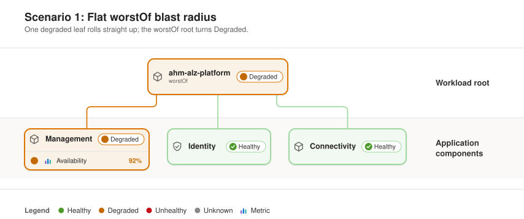
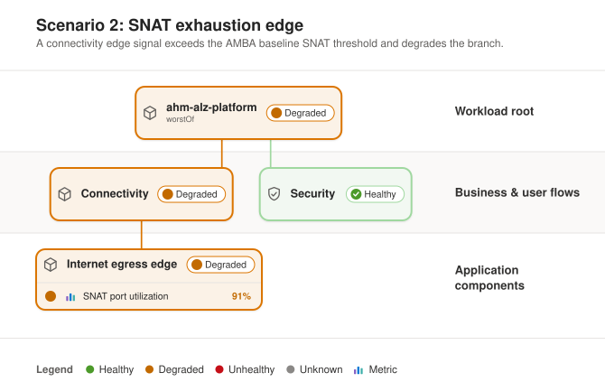
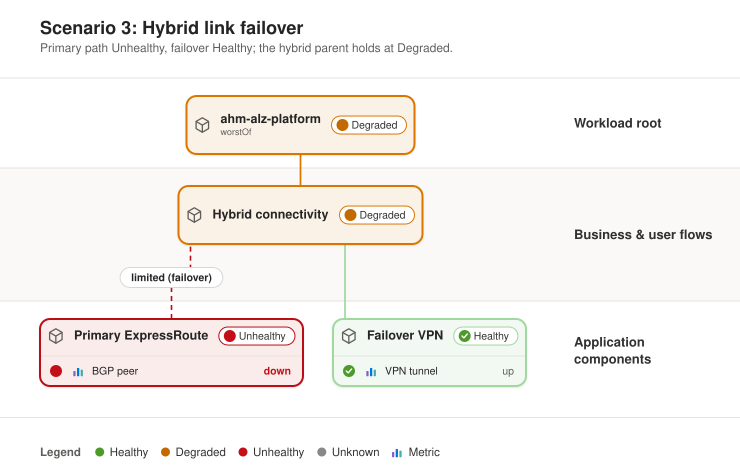
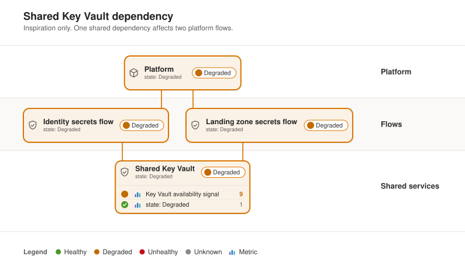
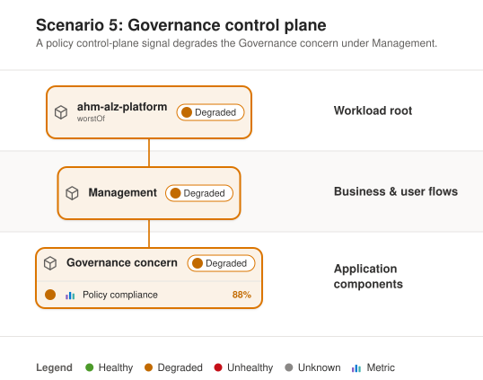
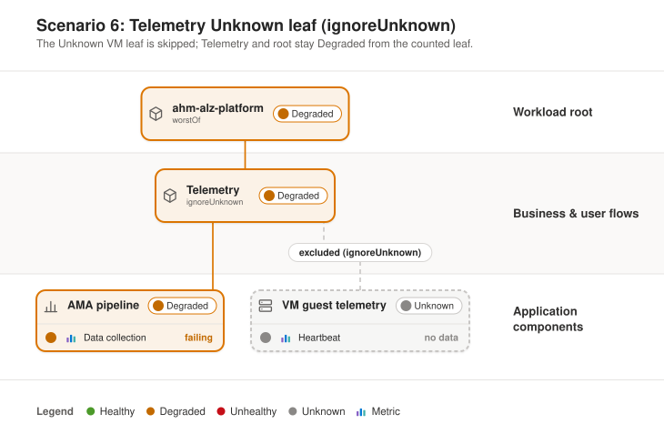
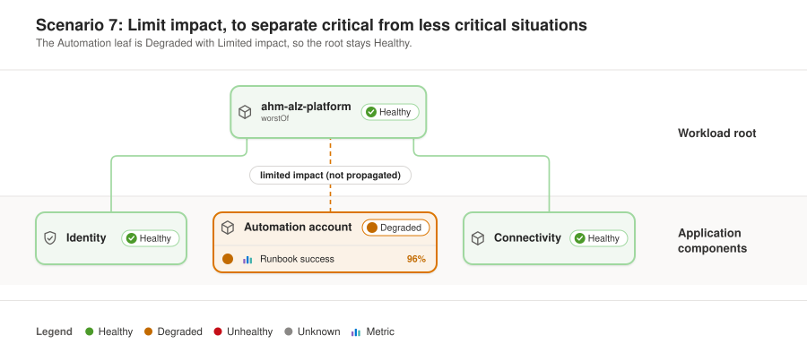

# ALZ platform health model guide

The v1 ALZ structure is a parent model (`ahm-alz-platform`) plus five domain child models (`ahm-alz-security`, `ahm-alz-identity`, `ahm-alz-connectivity`, `ahm-alz-management`, `ahm-alz-landing-zones`). Each parent domain entity is linked to a narrow discovery rule filtered by `alzHealthModelRole=domain`, `alzHealthModelDomain=<key>`, and `alzHealthModelParent=ahm-alz-platform`, scoped to the health-model resource group.

<!-- diagrammo:sync alz-platform-health-model-guide -->


<!-- diagrammo:source
```mermaid
flowchart TD
  R["ahm-alz-platform<br/>root"]

  E1["Security<br/>entity"] --&gt; D1["Security discovery<br/>rule"] --&gt; C1["ahm-alz-security<br/>child model"]
  E2["Identity<br/>entity"] --&gt; D2["Identity discovery<br/>rule"] --&gt; C2["ahm-alz-identity<br/>child model"]
  E3["Connectivity<br/>entity"] --&gt; D3["Connectivity discovery<br/>rule"] --&gt; C3["ahm-alz-connectivity<br/>child model"]
  E4["Management<br/>entity"] --&gt; D4["Management discovery<br/>rule"] --&gt; C4["ahm-alz-management<br/>child model"]
  E5["Application Landing Zones<br/>entity"] --&gt; D5["Application Landing Zones discovery<br/>rule"] --&gt; C5["ahm-alz-landing-zones<br/>child model"]

  R --&gt; E1
  R --&gt; E2
  R --&gt; E3
  R --&gt; E4
  R --&gt; E5
```
-->
<!-- /diagrammo:sync alz-platform-health-model-guide -->

## Domains

| Display | Key | Child model |
|---|---|---|
| Security | `security` | `ahm-alz-security` |
| Identity | `identity` | `ahm-alz-identity` |
| Connectivity | `connectivity` | `ahm-alz-connectivity` |
| Management | `management` | `ahm-alz-management` |
| Application Landing Zones | `landing-zones` | `ahm-alz-landing-zones` |

Governance and Observability are illustrative sub-concerns inside Management, not separate shipped domains.

## Scenarios (illustrative)

These seven scenarios illustrate rollup behavior after you add real entities and signals to each domain. The shipped skeleton currently has one placeholder entity per child model.

In the diagrams below, solid connectors are counted roll-up edges and dashed connectors mark propagation that is limited or ignored (a failover path, a Limited-impact leaf, or an Unknown leaf excluded by `ignoreUnknown`).

### Scenario 1: Flat worstOf blast radius

**Flat worstOf blast radius**. If one leaf degrades under `WorstOf`, that degraded state rolls up directly to its parent path and the root becomes Degraded.

<!-- diagrammo:sync scenario-1-flat-worstof-blast-radius -->


<!-- diagrammo:source
```mermaid
%%| title: Scenario 1: Flat worstOf blast radius
%%| subtitle: One degraded leaf rolls straight up; the worstOf root turns Degraded.
flowchart BT
    availability["Availability = 92% (degraded)"] --&gt; management["Management<br/>degraded"]
    management --&gt; root["ahm-alz-platform<br/>(worstOf)<br/>degraded"]
    identity["Identity<br/>healthy"] --&gt; root
    connectivity["Connectivity<br/>healthy"] --&gt; root

    classDef blue fill:#eff6fc,stroke:#0078D4;
    classDef green fill:#f2f8f2,stroke:#a0d8a0;
    classDef amber fill:#fbf2e7,stroke:#db7500;
    classDef red fill:#faeceb,stroke:#ba0d16;
    classDef purple fill:#f3effc,stroke:#8661c5;
    class availability blue;
    class identity,connectivity green;
    class management,root amber;
```
-->
<!-- /diagrammo:sync scenario-1-flat-worstof-blast-radius -->

Docs: [Health model concepts (worst-of aggregation)](https://learn.microsoft.com/en-us/azure/azure-monitor/health-models/concepts) and [Configure health rollup](https://learn.microsoft.com/en-us/azure/azure-monitor/health-models/rollup).

### Scenario 2: SNAT exhaustion edge

**SNAT exhaustion edge**. If a connectivity edge signal shows SNAT utilization above the AMBA threshold, the connectivity branch degrades and the root becomes Degraded.

<!-- diagrammo:sync scenario-2-snat-exhaustion-edge -->


<!-- diagrammo:source
```mermaid
%%| title: Scenario 2: SNAT exhaustion edge
%%| subtitle: A connectivity edge signal exceeds the AMBA baseline SNAT threshold and degrades the branch.
flowchart BT
    snat["SNAT port utilization = 91% (degraded)"] --&gt; edge["Internet egress edge<br/>degraded"]
    edge --&gt; connectivity["Connectivity<br/>degraded"]
    connectivity --&gt; root["ahm-alz-platform<br/>(worstOf)<br/>degraded"]
    security["Security<br/>healthy"] --&gt; root

    classDef blue fill:#eff6fc,stroke:#0078D4;
    classDef green fill:#f2f8f2,stroke:#a0d8a0;
    classDef amber fill:#fbf2e7,stroke:#db7500;
    classDef red fill:#faeceb,stroke:#ba0d16;
    classDef purple fill:#f3effc,stroke:#8661c5;
    class snat blue;
    class security green;
    class edge,connectivity,root amber;
```
-->
<!-- /diagrammo:sync scenario-2-snat-exhaustion-edge -->

Docs: [Signals in health models](https://learn.microsoft.com/en-us/azure/azure-monitor/health-models/signals), [Load Balancer SNAT metrics and alerts](https://learn.microsoft.com/en-us/azure/load-balancer/load-balancer-standard-diagnostics), and [SNAT for outbound connections](https://learn.microsoft.com/en-us/azure/load-balancer/load-balancer-outbound-connections). AMBA baseline thresholds are published at [Azure Monitor Baseline Alerts](https://azure.github.io/azure-monitor-baseline-alerts/welcome/) (community site, not Microsoft Learn).

### Scenario 3: Hybrid link failover

**Hybrid link failover**. If a hybrid connectivity parent has primary and failover paths and the primary fails, the hybrid parent is Degraded while the primary is Unhealthy and the failover remains Healthy.

<!-- diagrammo:sync scenario-3-hybrid-link-failover -->


<!-- diagrammo:source
```mermaid
%%| title: Scenario 3: Hybrid link failover
%%| subtitle: Primary path Unhealthy, failover Healthy; the hybrid parent holds at Degraded.
flowchart BT
    bgp["BGP peer = down (unhealthy)"] --&gt; primary["Primary ExpressRoute<br/>unhealthy"]
    primary -. "limited (failover)" .-> hybrid["Hybrid connectivity<br/>degraded"]
    vpn["VPN tunnel = up (healthy)"] --&gt; failover["Failover VPN<br/>healthy"]
    failover --&gt; hybrid
    hybrid --&gt; root["ahm-alz-platform<br/>(worstOf)<br/>degraded"]

    classDef blue fill:#eff6fc,stroke:#0078D4;
    classDef green fill:#f2f8f2,stroke:#a0d8a0;
    classDef amber fill:#fbf2e7,stroke:#db7500;
    classDef red fill:#faeceb,stroke:#ba0d16;
    classDef purple fill:#f3effc,stroke:#8661c5;
    class bgp,vpn blue;
    class failover green;
    class hybrid,root amber;
    class primary red;
```
-->
<!-- /diagrammo:sync scenario-3-hybrid-link-failover -->

Docs: [Health model concepts (relationships and impact)](https://learn.microsoft.com/en-us/azure/azure-monitor/health-models/concepts) and [Configure health rollup](https://learn.microsoft.com/en-us/azure/azure-monitor/health-models/rollup).

### Scenario 4: Shared Key Vault dependency

**Shared key vault**. If a shared Key Vault dependency degrades, every flow that depends on that vault degrades and the root also degrades.

<!-- diagrammo:sync scenario-4-shared-key-vault-dependency -->


<!-- diagrammo:source
```mermaid
%%| title: Scenario 4: Shared Key Vault dependency
%%| subtitle: One shared vault degrades; every dependent flow and the root follow.
flowchart BT
    vault["Availability = 97.9% (degraded)"] --&gt; kv["Shared Key Vault<br/>degraded"]
    kv --&gt; identityflow["Identity secrets flow<br/>degraded"]
    kv --&gt; appflow["App landing-zone secrets flow<br/>degraded"]
    identityflow --&gt; root["ahm-alz-platform<br/>(worstOf)<br/>degraded"]
    appflow --&gt; root

    classDef blue fill:#eff6fc,stroke:#0078D4;
    classDef green fill:#f2f8f2,stroke:#a0d8a0;
    classDef amber fill:#fbf2e7,stroke:#db7500;
    classDef red fill:#faeceb,stroke:#ba0d16;
    classDef purple fill:#f3effc,stroke:#8661c5;
    class vault blue;
    class kv,identityflow,appflow,root amber;
```
-->
<!-- /diagrammo:sync scenario-4-shared-key-vault-dependency -->

Docs: [Health model concepts (shared dependencies)](https://learn.microsoft.com/en-us/azure/azure-monitor/health-models/concepts) and [Configure health rollup](https://learn.microsoft.com/en-us/azure/azure-monitor/health-models/rollup).

### Scenario 5: Governance control plane

**Governance control plane**. If a governance or policy control-plane signal degrades, the governance concern degrades and that state rolls up to a Degraded root.

<!-- diagrammo:sync scenario-5-governance-control-plane -->


<!-- diagrammo:source
```mermaid
%%| title: Scenario 5: Governance control plane
%%| subtitle: A policy control-plane signal degrades the Governance concern under Management.
flowchart BT
    policy["Policy compliance = 88% (degraded)"] --&gt; governance["Governance concern<br/>degraded"]
    governance --&gt; management["Management<br/>degraded"]
    management --&gt; root["ahm-alz-platform<br/>(worstOf)<br/>degraded"]

    classDef blue fill:#eff6fc,stroke:#0078D4;
    classDef green fill:#f2f8f2,stroke:#a0d8a0;
    classDef amber fill:#fbf2e7,stroke:#db7500;
    classDef red fill:#faeceb,stroke:#ba0d16;
    classDef purple fill:#f3effc,stroke:#8661c5;
    class policy blue;
    class governance,management,root amber;
```
-->
<!-- /diagrammo:sync scenario-5-governance-control-plane -->

Docs: [Signals in health models](https://learn.microsoft.com/en-us/azure/azure-monitor/health-models/signals) and [Health model concepts](https://learn.microsoft.com/en-us/azure/azure-monitor/health-models/concepts).

### Scenario 6: Telemetry Unknown leaf

**Telemetry unknown leaf**. If a telemetry leaf is Unknown and `ignoreUnknown` is enabled, that Unknown leaf is skipped in the rollup so telemetry and root can still be Degraded from other counted leaves while a VM leaf remains Unknown.

<!-- diagrammo:sync scenario-6-telemetry-unknown-leaf-ignoreunknown -->


<!-- diagrammo:source
```mermaid
%%| title: Scenario 6: Telemetry Unknown leaf (ignoreUnknown)
%%| subtitle: The Unknown VM leaf is skipped; Telemetry and root stay Degraded from the counted leaf.
flowchart BT
    collection["Data collection = failing (degraded)"] --&gt; ama["AMA pipeline<br/>degraded"]
    ama --&gt; telemetry["Telemetry<br/>(ignoreUnknown)<br/>degraded"]
    heartbeat["Heartbeat = no data (unknown)"] --&gt; vm["VM guest telemetry<br/>unknown"]
    vm -. "excluded (ignoreUnknown)" .-> telemetry
    telemetry --&gt; root["ahm-alz-platform<br/>(worstOf)<br/>degraded"]

    classDef blue fill:#eff6fc,stroke:#0078D4;
    classDef green fill:#f2f8f2,stroke:#a0d8a0;
    classDef amber fill:#fbf2e7,stroke:#db7500;
    classDef red fill:#faeceb,stroke:#ba0d16;
    classDef purple fill:#f3effc,stroke:#8661c5;
    class collection,heartbeat blue;
    class ama,telemetry,root amber;
```
-->
<!-- /diagrammo:sync scenario-6-telemetry-unknown-leaf-ignoreunknown -->

Docs: [Configure health rollup (Ignore unknown)](https://learn.microsoft.com/en-us/azure/azure-monitor/health-models/rollup) and [Signals in health models](https://learn.microsoft.com/en-us/azure/azure-monitor/health-models/signals).

### Scenario 7: Limit impact, to separate critical from less critical situations

**Impact lever**. If a degraded leaf changes impact from Standard to Limited, it no longer drags the root down, so the root can stay Healthy while the Automation leaf remains Degraded with Limited impact.

<!-- diagrammo:sync scenario-7-impact-lever-standard-to-limited -->


<!-- diagrammo:source
```mermaid
%%| title: Scenario 7: Limit impact, to separate critical from less critical situations
%%| subtitle: The Automation leaf is Degraded with Limited impact, so the root stays Healthy.
flowchart BT
    identity["Identity<br/>healthy"] --&gt; root["ahm-alz-platform<br/>(worstOf)<br/>healthy"]
    runbook["Runbook success = 96% (degraded)"] --&gt; automation["Automation account<br/>degraded"]
    automation -. "limited impact (not propagated)" .-> root
    connectivity["Connectivity<br/>healthy"] --&gt; root

    classDef blue fill:#eff6fc,stroke:#0078D4;
    classDef green fill:#f2f8f2,stroke:#a0d8a0;
    classDef amber fill:#fbf2e7,stroke:#db7500;
    classDef red fill:#faeceb,stroke:#ba0d16;
    classDef purple fill:#f3effc,stroke:#8661c5;
    class runbook blue;
    class automation amber;
    class identity,connectivity,root green;
```
-->
<!-- /diagrammo:sync scenario-7-impact-lever-standard-to-limited -->

Docs: [Health model concepts (impact)](https://learn.microsoft.com/en-us/azure/azure-monitor/health-models/concepts) and [Configure health rollup](https://learn.microsoft.com/en-us/azure/azure-monitor/health-models/rollup).

## Learn more

Azure Monitor health models documentation on Microsoft Learn:

- [Health models overview](https://learn.microsoft.com/en-us/azure/azure-monitor/health-models/overview)
- [Health model concepts](https://learn.microsoft.com/en-us/azure/azure-monitor/health-models/concepts)
- [Signals](https://learn.microsoft.com/en-us/azure/azure-monitor/health-models/signals)
- [Configure health rollup](https://learn.microsoft.com/en-us/azure/azure-monitor/health-models/rollup)
- [Create discovery rules](https://learn.microsoft.com/en-us/azure/azure-monitor/health-models/discoveries)
- [Create a health model](https://learn.microsoft.com/en-us/azure/azure-monitor/health-models/create)
- [Configure a health model with the designer](https://learn.microsoft.com/en-us/azure/azure-monitor/health-models/designer)
- [Monitor a health model](https://learn.microsoft.com/en-us/azure/azure-monitor/health-models/monitoring)
