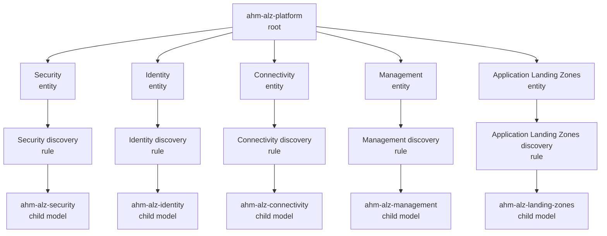

# ALZ platform health model guide

The v1 ALZ structure is a parent model (`ahm-alz-platform`) plus five domain child models (`ahm-alz-security`, `ahm-alz-identity`, `ahm-alz-connectivity`, `ahm-alz-management`, `ahm-alz-landing-zones`). Each parent domain entity is linked to a narrow discovery rule filtered by `alzHealthModelRole=domain`, `alzHealthModelDomain=<key>`, and `alzHealthModelParent=ahm-alz-platform`, scoped to the health-model resource group.

## Domains

| Display | Key | Child model |
|---|---|---|
| Security | `security` | `ahm-alz-security` |
| Identity | `identity` | `ahm-alz-identity` |
| Connectivity | `connectivity` | `ahm-alz-connectivity` |
| Management | `management` | `ahm-alz-management` |
| Application Landing Zones | `landing-zones` | `ahm-alz-landing-zones` |

Governance and Observability are illustrative sub-concerns inside Management, not separate shipped domains.

## Scenarios (illustrative)

These seven scenarios illustrate rollup behavior after you add real entities and signals to each domain. The shipped skeleton currently has one placeholder entity per child model.

1. **Flat worstOf blast radius**. If one leaf degrades under `WorstOf`, that degraded state rolls up directly to its parent path and the root becomes Degraded.
2. **SNAT exhaustion edge**. If a connectivity edge signal shows SNAT utilization above the AMBA threshold, the connectivity branch degrades and the root becomes Degraded.
3. **Hybrid link failover**. If a hybrid connectivity parent has primary and failover paths and the primary fails, the hybrid parent is Degraded while the primary is Unhealthy and the failover remains Healthy.
4. **Shared key vault**. If a shared Key Vault dependency degrades, every flow that depends on that vault degrades and the root also degrades.
5. **Governance control plane**. If a governance or policy control-plane signal degrades, the governance concern degrades and that state rolls up to a Degraded root.
6. **Telemetry unknown leaf**. If a telemetry leaf is Unknown and `ignoreUnknown` is enabled, that Unknown leaf is skipped in the rollup so telemetry and root can still be Degraded from other counted leaves while a VM leaf remains Unknown.
7. **Impact lever**. If a degraded leaf changes impact from Standard to Limited, it no longer drags the root down, so the root can stay Healthy while the Automation leaf remains Degraded with Limited impact.
